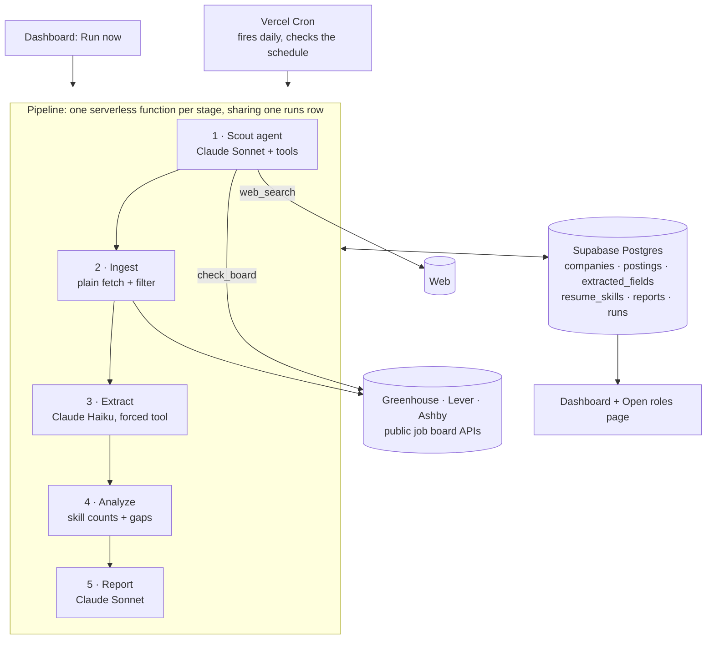

# SWE Job Market Agent

An AI agent pipeline that finds fresh entry-level software engineering jobs, works out what skills they actually ask for, compares those skills against my resume, and tells me what to apply to today and what to learn next.

**Live:** [job-agent-project.vercel.app](https://job-agent-project.vercel.app)

It runs on its own every day:

1. An autonomous **scout agent** searches the web for companies hiring new grads and adds them to a watchlist.
2. Every company's public job board is pulled, and entry-level roles are kept.
3. **Claude Haiku** turns each job description into structured data: required skills, years of experience, tech stack.
4. The skills are compared against my resume.
5. **Claude Sonnet** writes a personalized report with project ideas and a study plan.
6. A dashboard shows the newest openings first, because applying early is the best edge an applicant has.

Built with Next.js, TypeScript, the Anthropic API, Supabase and Vercel Cron.

---

## Contents

- [Results](#results)
- [How it works, step by step](#how-it-works-step-by-step)
- [Architecture](#architecture)
- [The original plan](#the-original-plan)
- [What changed during development](#what-changed-during-development)
- [Running it yourself](#running-it-yourself)
- [Costs](#costs)
- [Limitations and next steps](#limitations-and-next-steps)

---

## Results

Figures from the first full runs, September 25, 2026.

### Job search

| | |
|---|---|
| Companies watched | **30** (25 seeded by hand, **5 found by the scout agent**) |
| Open jobs scanned per run | **~7,100** across Greenhouse, Lever and Ashby boards |
| Entry-level postings kept | **186** |
| Unique open roles | **144** (a role posted in several cities counts once) |
| Roles posted in the last week | **9**, 2 of them posted that same day |

The scout's first unsupervised run added **Benchling, Zip, WeRide, ZipRecruiter and IMC Trading**. It checked 18 job boards, made 12 web searches, and explained why it rejected the others. For Okta and OKX, for example, it said: "large engineering orgs but zero entry-level roles open right now". Those 5 companies contributed **27 new postings**, 16 of them from IMC Trading alone.

### Skills analysis

Across the 144 roles, my resume covers **14 of the 20 most requested skills**.

| Most requested | Share of roles | On my resume? |
|---|---|---|
| Python | 55% | ✅ |
| Java | 35% | ✅ |
| TypeScript | 31% | ✅ |
| C++ | 29% | ✅ |
| JavaScript | 27% | ✅ |
| React | 26% | ✅ |
| Data Structures & Algorithms | 24% | ✅ |

| Biggest gaps | Share of roles | Roles that *require* it |
|---|---|---|
| Distributed Systems | 24% | 23 |
| Go | 23% | 30 |
| Machine Learning | 22% | 11 (mostly listed as nice to have) |
| Kubernetes | 18% | 11 |
| Cloud Infrastructure | 16% | 10 |
| System Design | 14% | 16 |

**Conclusion:** my languages already match the market. What's missing is systems and infrastructure depth.

### The generated report

Sonnet turns these numbers into a report. It:

- ranks the gaps by how often each skill is *required*, not just mentioned;
- flags gaps that are weaker than they look, like Machine Learning (usually nice to have) or Storage Systems (every mention came from one company);
- proposes three portfolio projects that each close several gaps: a distributed job scheduler in Go, a Kubernetes deployment with observability, and an ML inference service;
- adds a study plan with specific resources.

I checked every figure in the first report against the raw data. All of them matched except one: the model summed two overlapping percentages. That's why I verify generated numbers.

---

## How it works, step by step

The pipeline has five stages. Each runs as its own serverless function (see [why](#5-vercels-300-second-limit-forced-a-staged-pipeline)). All five share one row in a `runs` table, which records what the day's run found and what it cost.

### Step 1: Scout (the autonomous agent)
*[`src/lib/scout.ts`](src/lib/scout.ts)*

This is the actually agentic part. Claude Sonnet gets three tools and a goal: *find companies likely hiring entry-level engineers that aren't on the watchlist and have a public job board*.

| Tool | Runs where | What it does |
|---|---|---|
| `web_search` | Anthropic's servers | Searches the web, e.g. `"new grad software engineer" site:jobs.ashbyhq.com` |
| `check_board` | My code | Calls the job board API and returns total, engineering and entry-level job counts, plus sample titles |
| `add_company` | My code | Adds the company to the watchlist |

The agent loop is written by hand, so every step is visible:

1. Call Claude.
2. If it asked for tools, run them and send all the results back in one message.
3. If a web search paused the turn, send the conversation back to resume it.
4. Repeat until Claude stops asking for tools.

Claude decides each step itself: what to search for, which company names to guess as board URLs, retrying variants after a 404, and which candidates to reject and why.

**Guardrails are enforced in code, not just the prompt:**

- `add_company` refuses any board that `check_board` didn't confirm in the same run.
- Board names are validated before they're used in a URL, because the model may have read them off an arbitrary web page.
- At most **5 companies per day**, 20 model calls and 15 searches per run.
- Tool failures go back to the model as errors it can fix (it did, after its 404s) instead of crashing the run.
- Prompt caching makes re-reading earlier turns 10× cheaper. That matters because an agent loop resends the whole conversation every turn.

### Step 2: Ingest
*[`src/lib/ingest.ts`](src/lib/ingest.ts), [`src/lib/ats/`](src/lib/ats/)*

Plain code, no AI. For each company, it fetches every open job from the **public, unauthenticated** job board APIs of Greenhouse, Lever and Ashby. There's no scraping and no terms-of-service risk.

- **One shape for all providers.** Each provider returns a different JSON shape, so each gets a small adapter that converts it to one `NormalizedPosting` type. This includes decoding Greenhouse's double-escaped HTML into readable text.
- **Rough entry-level filter** ([`src/lib/entry-level.ts`](src/lib/entry-level.ts)). A posting is kept if:
  - its **title** says entry-level ("New Grad", "Early Career", "Engineer I"), **or**
  - its **description** asks for **2 or fewer years** of experience ("1-3 years", "2+ years").

  It drops senior titles, internships, and "engineer" roles that aren't software engineering (sales engineer, support engineer, developer relations). I tested it against all ~9,400 real job titles before relying on it.
- **Deduplication and tracking.** Postings are deduplicated by each board's own job ID. Postings seen before get a `last_seen_at` update, so the system knows which roles are still open and which are new.

### Step 3: Extract
*[`src/lib/extract.ts`](src/lib/extract.ts)*

Claude Haiku reads each new job description and is **forced to call a `save_extraction` tool** with a strict JSON schema:

```
required_skills[], nice_to_have_skills[], years_experience, responsibilities[], tech_stack[], seniority_signal
```

This is the first real tool call in the project, even though nothing executes. The tool's schema is a reliable way to get structured data back, and `strict: true` makes the API guarantee valid output.

- **Consistent skill names.** The prompt insists on them ("Go" not "Golang", "Kubernetes" not "K8s"), because everything downstream counts across hundreds of postings.
- **Resumable.** It only processes postings with no extraction yet, retries bad responses, and stops itself before the function time limit, so a later pass picks up where it left off.
- **Cost:** about **$0.004 per posting**.

### Step 4: Analyze
*[`src/lib/analysis.ts`](src/lib/analysis.ts), [`src/lib/skills.ts`](src/lib/skills.ts), [`src/lib/resume.ts`](src/lib/resume.ts)*

Pure code. It:

1. Keeps roles that are **still open** and that the LLM confirmed ask for **≤ 2 years**. The LLM reading is more reliable than the Step 2 filter; it caught a posting where "two years' worth of experience in your first 6 months" was recruiting copy, not a requirement.
2. Counts a role posted in several cities **once**, so one company's boilerplate can't dominate the counts.
3. Maps every skill to one canonical name with an alias map built from the real data ("Frontend development" / "Front-end Development" / "Frontend" → one skill), and drops non-skills like "Strong coding skills".
4. Compares the counts against my resume skills and splits them into **gaps** and **matches**.

Resume skills are extracted once with the same naming rules. Every skill must come with an **evidence quote** that is checked against the resume text, so the model can't add skills I don't have (see [below](#3-the-resume-extractor-invented-skills-i-dont-have)).

### Step 5: Report
*[`src/lib/report.ts`](src/lib/report.ts)*

Claude Sonnet gets the analysis, which companies ask for each skill, and my resume skills, and writes the Markdown report. It covers:

- where I stand;
- what the market wants;
- my gaps in priority order;
- three project ideas with milestones and a ready-made resume bullet;
- a study plan;
- the limits of the data.

Each report saves the numbers it used. The next report compares against them for trends, and knows which companies were added since, so it doesn't mistake a bigger watchlist for a market shift.

### Step 6: Dashboard and Open roles
*[`src/app/page.tsx`](src/app/page.tsx), [`src/app/jobs/`](src/app/jobs/)*

- **Open roles page** (`/jobs`) is built for applying.
  - Roles are grouped by how recently they were posted: *last 3 days* ("apply to these first"), *this week*, *this month*, and *older* (collapsed).
  - Each role shows an application link per location, its experience requirement, and how many of its required skills I have, with the missing ones listed.
  - Filter by title, location (with SF Bay Area, Remote and New York shortcuts) or company, and sort by newest or best match.
- **Dashboard** (`/`) opens with the roles posted this week, then shows:
  - a bar chart of the most requested skills, colored by whether they're on my resume;
  - gap and match tables;
  - a trend chart across reports;
  - the latest report;
  - run history.

  Chart colors come from a palette I validated for colorblind separation in light and dark mode. Every chart has hover tooltips and a table view.
- **Pipeline controls** sit behind a password:
  - **Schedule:** daily, weekly or off.
  - **Run now:** runs the whole pipeline on demand, stage by stage, with live progress.

### Scheduling

Vercel Cron calls each stage every day (times in UTC):

| Time | Stage | Runs when |
|---|---|---|
| 12:00 | scout | daily, or on the chosen day if weekly |
| 14:00 | ingest | every day unless off |
| 15:00 | extract | every day unless off |
| 16:00 | extract (second pass) | only if the first pass left work |
| 18:00 | report | daily, or on the chosen day if weekly |

- **Why checking daily matters:** it costs almost nothing, and seeing a role the morning after it's posted matters more than anything else for applying. On the weekly setting, only the expensive stages (scout and report) wait for the weekly day.
- **Security:** each cron request must carry a secret token, so nobody else can trigger paid API calls.

---

## Architecture



| Layer | Choice | Why |
|---|---|---|
| App + API | Next.js (App Router), TypeScript | One language end to end, so learning agent concepts was the only new thing |
| LLM | `@anthropic-ai/sdk`: Claude Haiku 4.5 for extraction, Claude Sonnet 5 for the scout and report | Haiku is cheap enough for hundreds of postings; Sonnet for the reasoning-heavy steps |
| Database | Supabase (Postgres), row-level security on with no public access | Only the server's secret key can read or write |
| Scheduling | Vercel Cron | Same project and env vars as the app, nothing separate to manage |
| Charts | Recharts | |

---

## The original plan

I planned the project in phases, each verified before moving on:

| Phase | Goal | Done when |
|---|---|---|
| 0 · Foundations | Next.js, Supabase, Anthropic SDK, GitHub → Vercel all wired up | A script prints a Claude response; tables exist |
| 1 · Static ingestion | Real postings in the database, no AI yet | 50–150 postings stored |
| 2 · Extraction | Job descriptions turned into structured fields (first LLM tool call) | Every posting has skills to spot-check |
| 3 · Resume + gaps | Compare posting skills against my resume | "Kubernetes appears in X% of postings, not on your resume" |
| 4 · Report | Numbers turned into advice | A readable, personalized report |
| 5 · Autonomous scout | An agent that decides its own next step | Watchlist grows on its own |
| 6 · Scheduling | Runs without me | Fires on schedule, runs logged with cost |
| 7 · Dashboard | Something to demo | Charts, gaps, report, run history |
| 8 · Polish | This README | |

The order was deliberate: **get the plain data pipeline right before adding anything agentic.** If ingestion is broken, everything built on top of it produces confident-looking garbage.

---

## What changed during development

Most of what I learned came from where the plan met real data.

### 1. "Entry-level" needed a better definition
The plan filtered on titles ("new grad", "junior"). That found 52 postings, and Palantir alone accounted for more than half. Many real entry-level roles are just called "Software Engineer" and say "1-3 years" in the description. So the filter also accepts descriptions asking for **2 or fewer years**, which tripled the pool to 159. Regex can't read context, so the final decision uses the LLM's extracted `years_experience`.

### 2. Skill names and duplicate postings distorted the counts
- **Skill names:** the same skill came back under up to five names, which split its count. I added an alias map built from the real extracted vocabulary.
- **Duplicate postings:** Palantir posts each role once per city, so its boilerplate skills looked in demand. Gradle appeared in 21 postings but 0 required it. Counting each company + title once fixed that: Gradle dropped to 11, all nice to have.

### 3. The resume extractor invented skills I don't have
My first version showed Claude the postings' skill list so it would name resume skills consistently. It then listed **MongoDB and Flask**, neither of which is on my resume. Offering the model a list to choose from biased it toward that list.

The fix had two parts:
- Extract skills in the resume's own words and let the alias map do the renaming.
- Require an **evidence quote** for every skill. Code checks that the quote really appears in the resume and, for named technologies, that it contains the skill's name. That way a PostgreSQL line can't vouch for MongoDB.

### 4. The report mistook watchlist growth for a market trend
After the scout added IMC Trading, which has many C++ roles, the second report said *"C++ is rising… consistent with more backend-heavy postings this cycle."* The market hadn't changed; the sample had. Reports now record which companies they covered, and the model is told which companies are new and must attribute shifts to them before calling anything a trend.

### 5. Vercel's 300-second limit forced a staged pipeline
The plan had one cron route run everything. Measured locally, the scout, extraction and report together take longer than a Hobby-plan function may run. So:
- Each stage is its own cron route, spaced out to allow for Vercel's up-to-59-minute timing slack.
- All the stages share one `runs` row.
- Long stages stop starting new work at 200 seconds and let a later pass finish.

### 6. The schedule had to be editable at runtime
I wanted daily / weekly / off controls on the dashboard, but Vercel cron schedules are fixed at deploy time. The crons now fire daily, and each one checks a `pipeline_settings` row the dashboard edits. "Run now" can't run the whole pipeline in one request either, for the same 300-second reason, so the browser calls the stages one after another and shows progress. The controls sit behind a password, because a public button that spends API credits is a liability.

### 7. The goal shifted from analysis to getting hired
The plan was a market-intelligence tool. Using it made clear that the most valuable output is **a fresh list of roles to apply to**. So I added the Open roles page:
- roles grouped by posting date, with per-location apply links and a skill match;
- the dashboard leads with this week's postings;
- postings are checked **daily** even on the weekly schedule. That costs a few cents, and otherwise a new role could go unseen for six days.

### 8. I decided against auto-applying
I looked at having an agent submit applications. Each company's application API needs a key only that company has, so the only route is browser automation through forms with custom questions, CAPTCHAs and terms that prohibit it. And spraying generic applications can burn your one shot at a company. The better design is human in the loop: an agent drafts tailored answers and I review and submit. See [next steps](#limitations-and-next-steps).

### Smaller things worth noting
- **Guardrails in code:** the scout's safety limits are enforced by the tool functions, not the prompt. A manipulated or confused agent can at worst add a real, verified job board, and at most 5 a day.
- **Checking generated numbers:** I verified the report against the raw analysis instead of trusting it, and found the one arithmetic slip.
- **Supabase errors:** they aren't JavaScript `Error` objects, so my first error handling reported them as `[object Object]`. A small `errorMessage()` helper fixed it everywhere.
- **Timeouts:** Sonnet calls stream (`finalMessage()`), so long reports don't hit HTTP timeouts.

---

## Running it yourself

### 1. Accounts and keys
- An [Anthropic API key](https://console.anthropic.com/settings/keys)
- A [Supabase](https://supabase.com) project. You need its Project URL and its **secret** key (older projects call it `service_role`).
- Optional: a Vercel project connected to the GitHub repo

### 2. Database
In the Supabase SQL Editor, run these in order:
1. [`supabase/migrations/0001_init.sql`](supabase/migrations/0001_init.sql): tables
2. [`supabase/migrations/0002_pipeline_settings.sql`](supabase/migrations/0002_pipeline_settings.sql): the schedule

### 3. Environment
```bash
npm install
cp .env.example .env.local   # then fill it in
```

| Variable | Used for |
|---|---|
| `ANTHROPIC_API_KEY` | Claude |
| `SUPABASE_URL` | e.g. `https://abcd.supabase.co`, with no `/rest/v1` on the end |
| `SUPABASE_SECRET_KEY` | Server-only database access |
| `CRON_SECRET` | Any long random string; Vercel Cron sends it to `/api/cron/*` |
| `DASHBOARD_PASSWORD` | Unlocks the schedule and Run now controls |

On Vercel, add the same five variables. Tick **Preview** as well if you want preview deployments to work.

### 4. First run
```bash
npm run hello        # confirms the Claude key works
npm run check-db     # confirms every table exists
npm run seed         # adds the 25 starter companies
npm run ingest       # pulls entry-level postings
npm run extract      # structures them with Claude Haiku (add -- --limit 5 to try a few first)
npm run resume       # extracts your skills from private/resume.txt (gitignored)
npm run gaps         # prints the skill gap analysis
npm run report       # writes the personalized report
npm run scout        # lets the agent find new companies
npm run pipeline     # or: every stage in order, like the daily cron
npm run dev          # dashboard at http://localhost:3000
```

Your resume goes in `private/resume.txt`. The whole `private/` folder is gitignored, so personal details never reach the repo.

### Project layout
```
src/
  app/
    page.tsx                 dashboard
    jobs/                    Open roles page
    api/cron/[stage]/        cron entry point for each stage
    actions.ts               Server Functions: sign in, schedule, Run now
  lib/
    ats/                     Greenhouse / Lever / Ashby adapters
    entry-level.ts           title + years-of-experience filter
    ingest.ts                Step 2
    extract.ts               Step 3
    skills.ts, analysis.ts   Step 4
    resume.ts                resume extraction with evidence checks
    report.ts                Step 5
    scout.ts                 Step 1, the agent loop
    pipeline.ts              stages, shared runs, deadlines
    schedule.ts, settings.ts daily / weekly / off
scripts/                     one CLI entry point per step
supabase/migrations/         schema
```

---

## Costs

Measured on real runs:

| Stage | Model | Cost |
|---|---|---|
| Scout | Sonnet 5 + web search | ~$0.30 per run |
| Extract | Haiku 4.5 | ~$0.004 per new posting; the first 159 postings cost $0.62 |
| Report | Sonnet 5 | ~$0.08–0.10 |
| Ingest, analysis, dashboard | none | free |

- **Weekly schedule:** about **$2–3 a month**. The daily postings checks cost a few cents each; the full run with scout and report is about $0.50 a week.
- **Daily schedule:** about **$15 a month**.

Every run's tokens and cost are stored in `runs` and shown on the dashboard.

---

## Limitations and next steps

**Limitations**
- **The sample is the watchlist.** 30 mostly well-known tech and fintech companies aren't the whole market. The scout grows the list by up to 5 companies a day, and the report says when a shift is explained by new companies.
- **Rough filters.** The entry-level regex and the skill alias map are approximate. The LLM's `years_experience` is the real filter, and the alias map needs new entries as new skill names appear.
- **Missing posting dates.** Some boards report when a role was created, not when it was published. A few "old" roles may be reposts.
- **Board coverage.** Workday, iCIMS and LinkedIn aren't covered. They don't have clean public APIs, and scraping them is fragile and against their terms.

**Next steps**
1. **A daily email of new matching roles**, so fresh postings come to me instead of me checking the dashboard.
2. **An application-prep agent** that reads a role's description and its actual application questions (Greenhouse publishes them), then drafts tailored resume bullets and answers for me to review and submit.
3. **Applied / hidden tracking**, so the Open roles list only shows what I still need to act on.
4. **An evaluation set for extraction:** a few dozen hand-labeled postings to measure extraction accuracy when prompts or models change, instead of spot-checking.
